# System Architecture

This document provides a visual overview of the Return Shield platform architecture, including data flow diagrams and component interactions.

## Table of Contents

- [High-Level Architecture](#high-level-architecture)
- [Authentication Flow](#authentication-flow)
- [AI Analysis Pipeline](#ai-analysis-pipeline)
- [Case Management Flow](#case-management-flow)
- [Payment Processing Flow](#payment-processing-flow)
- [Notification System](#notification-system)
- [File Storage Architecture](#file-storage-architecture)

---

## High-Level Architecture

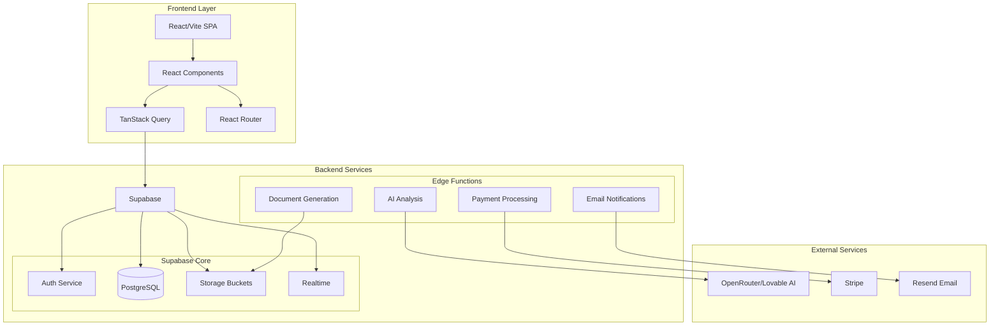

---

## Authentication Flow

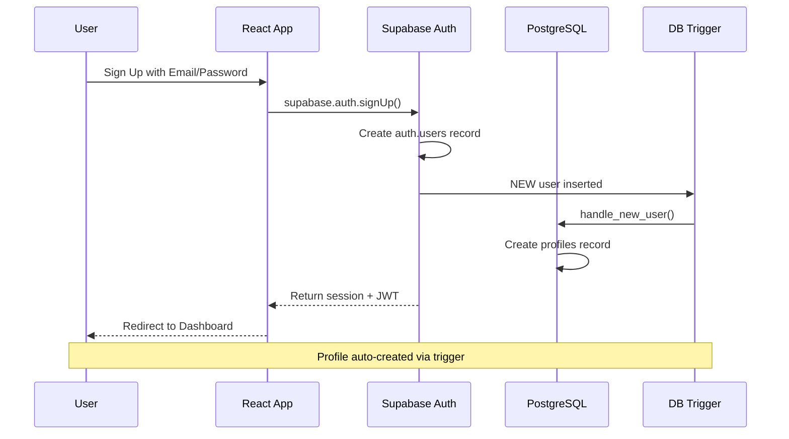

### Role-Based Access

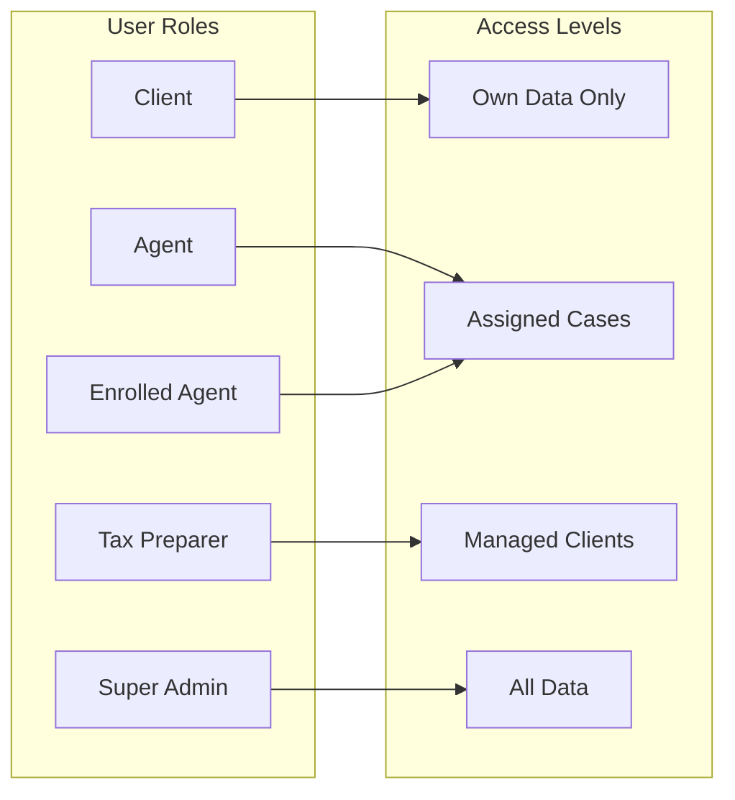

---

## AI Analysis Pipeline

### Notice Analysis Flow

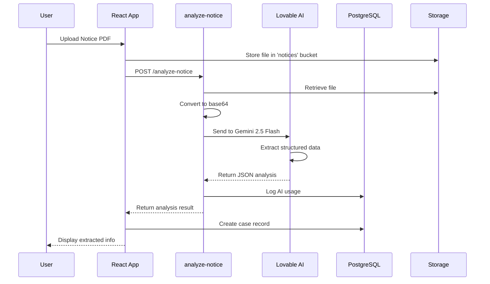

### Audit Risk Assessment Flow

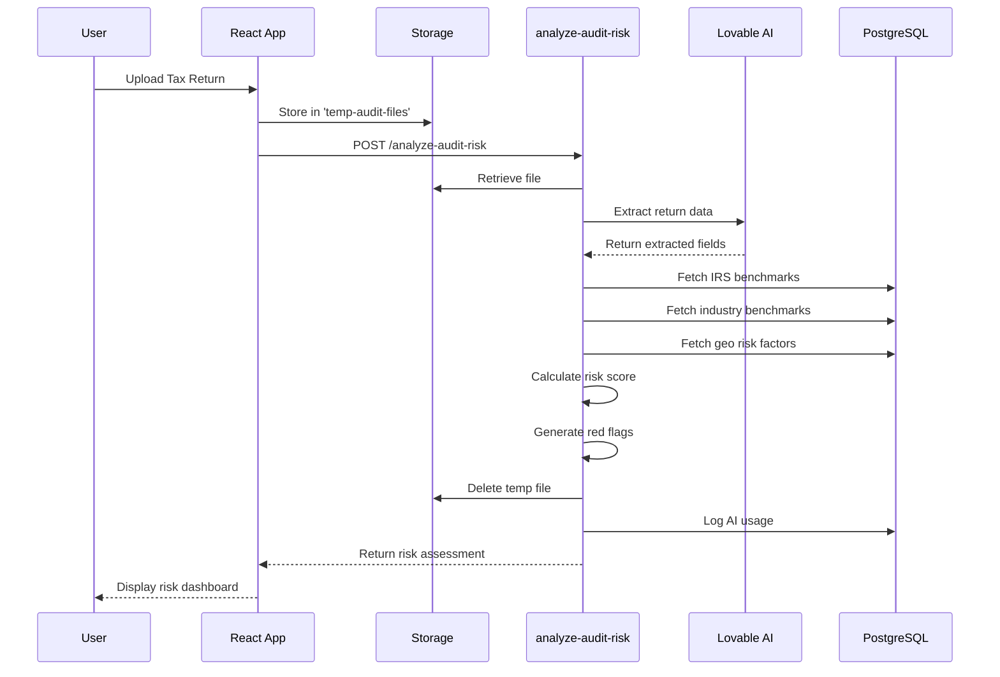

### Transcript Decoder Flow

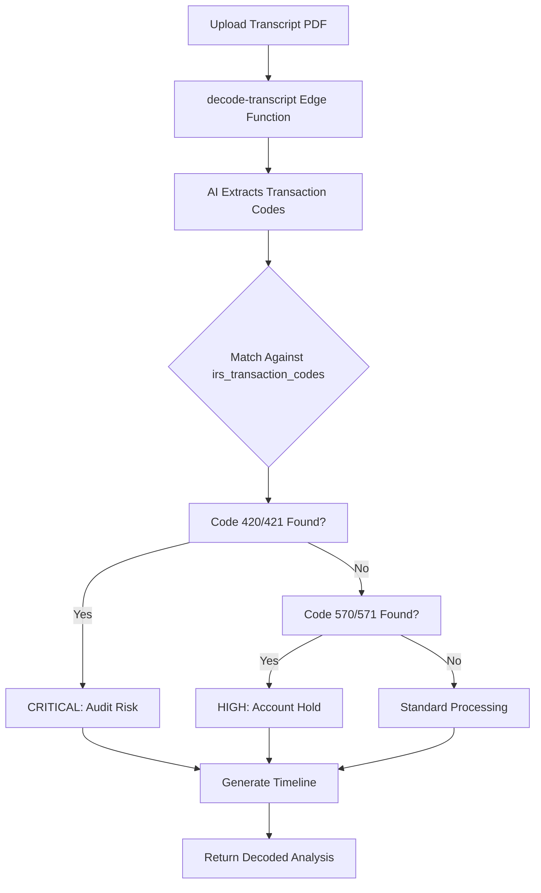

---

## Case Management Flow

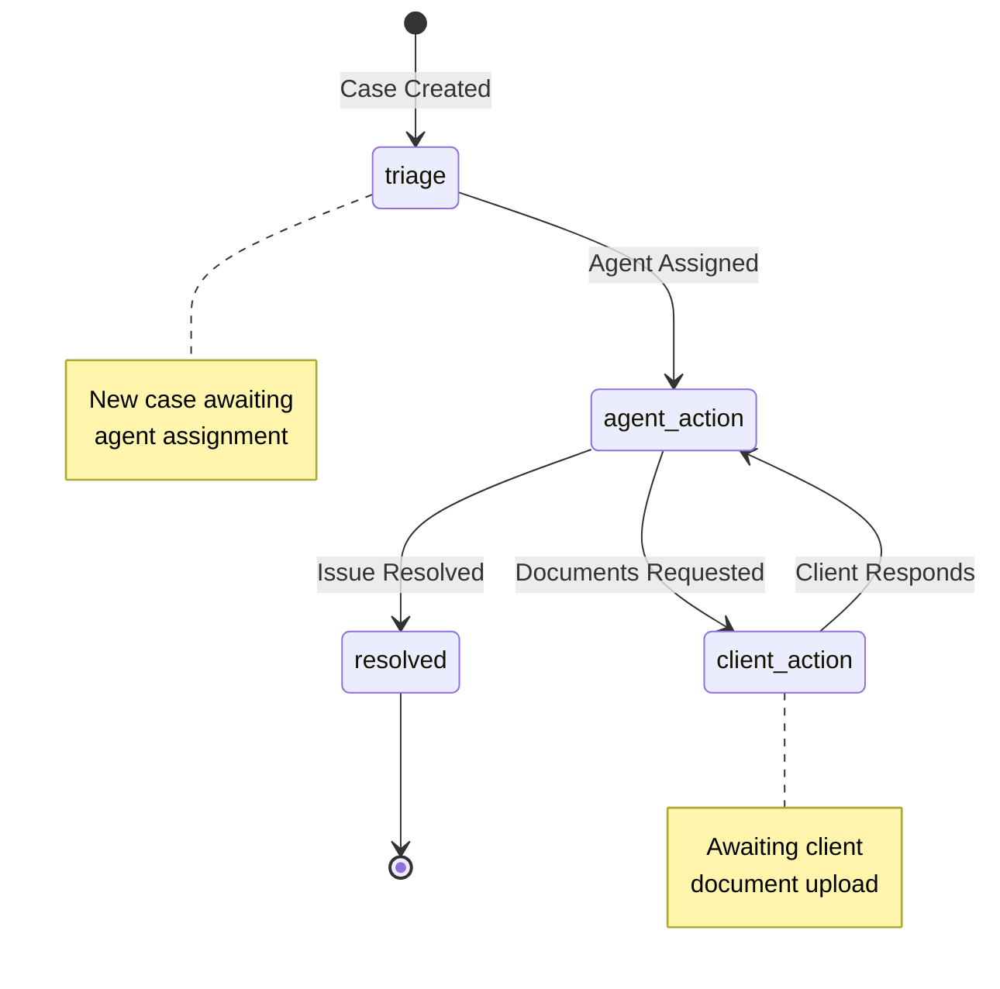

### Case Data Flow

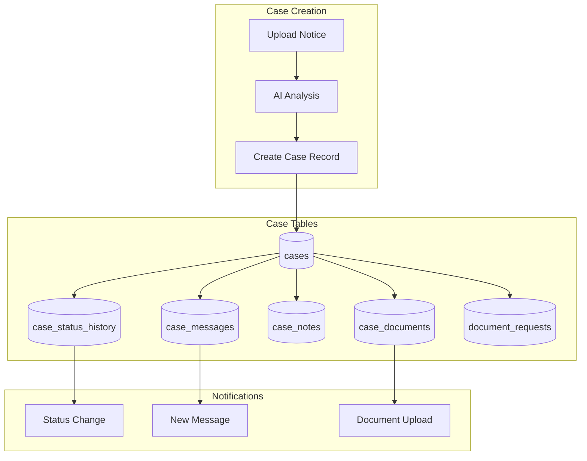

---

## Payment Processing Flow

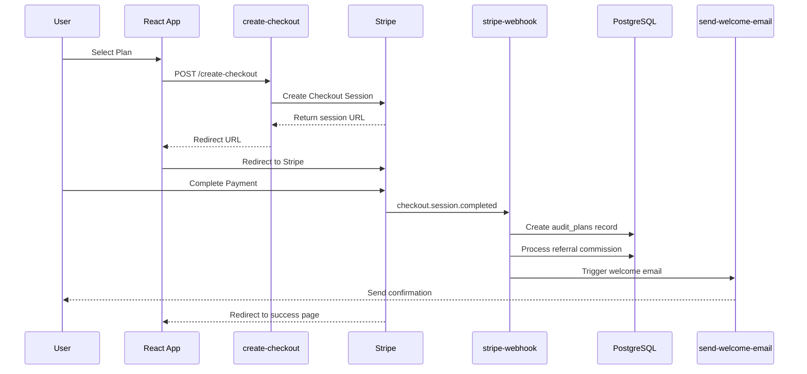

### Subscription Management

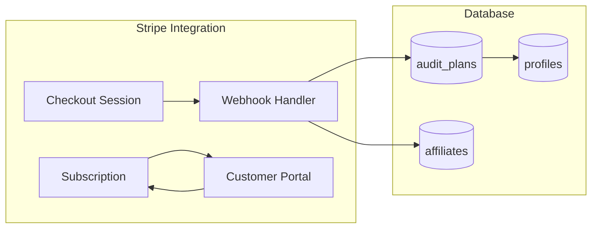

---

## Notification System

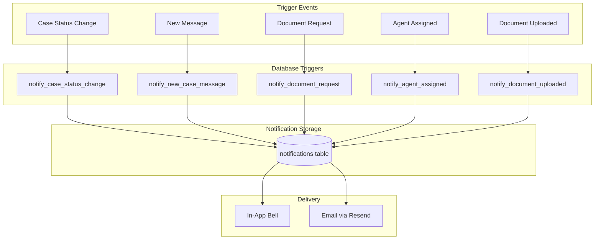

### Email Notification Flow

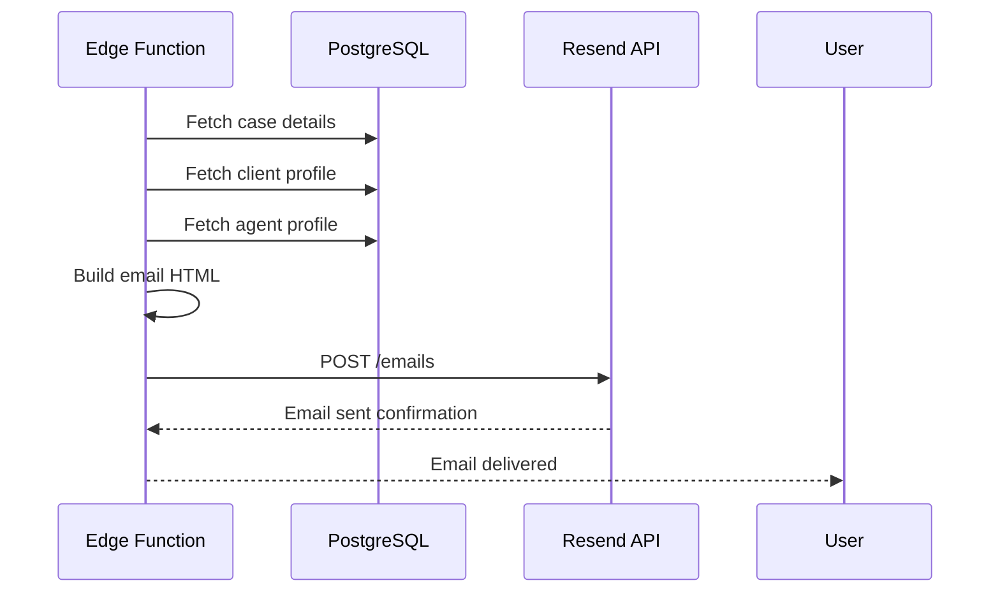

---

## File Storage Architecture

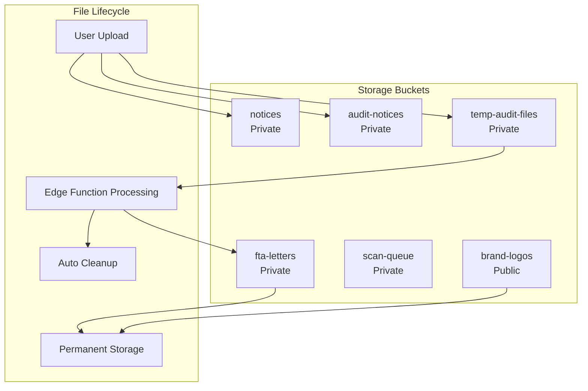

### Temporary File Cleanup

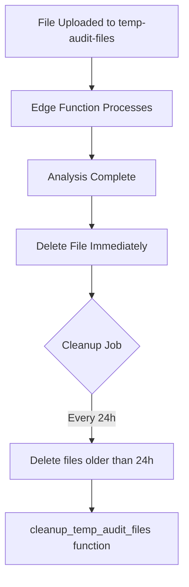

---

## Database Schema Overview

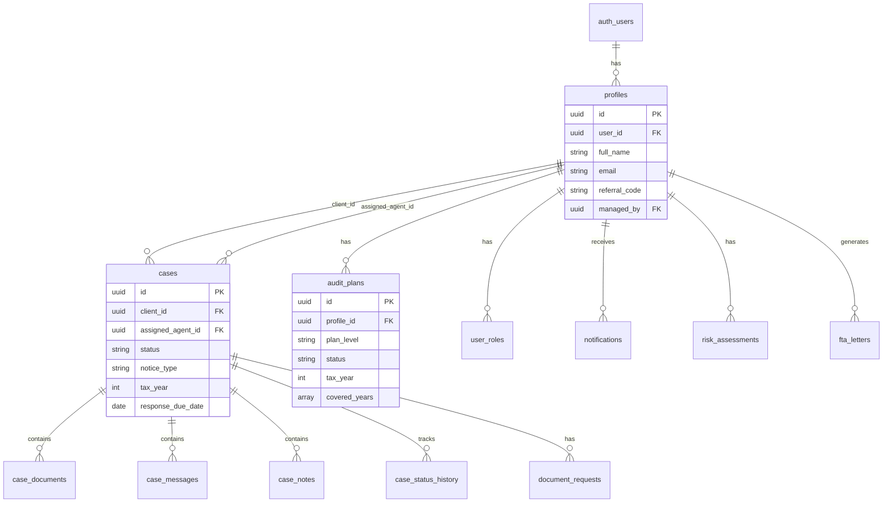

---

## Security Architecture

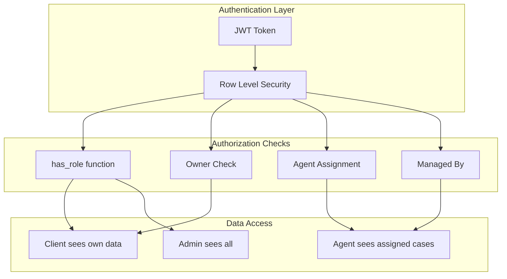

---

## Deployment Architecture

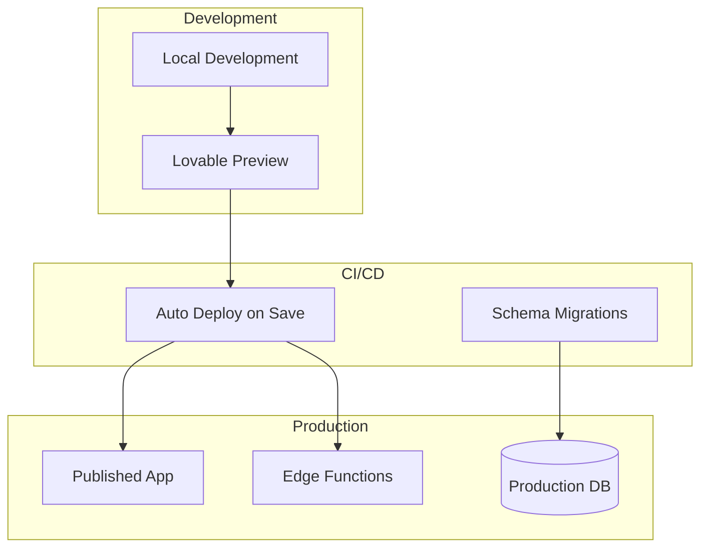

---

## Related Documentation

- [API.md](./API.md) - Complete API endpoint reference
- [DEVELOPER.md](./DEVELOPER.md) - Developer setup and guidelines
- [CONTRIBUTING.md](./CONTRIBUTING.md) - Contribution guidelines
